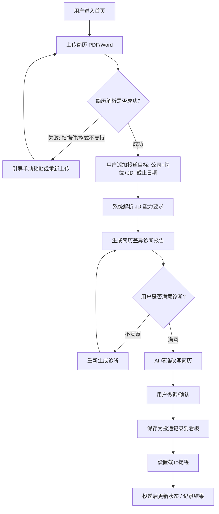

# 03 · 产品需求文档(PRD · 第二版)

> 落地版的目标:让这份文档能被 AI/开发者直接拿去实现。信息不足处标 `[待补充]`,不用模糊语言带过。

---

## 1. 产品概述

> 这是一个给**找实习 / 校招的学生**用的**网页 Web App**,帮他们把「盲投 + 手动改简历」变成「看懂 JD → 精准改简历 → 投递后复盘」的可持续求职流程。
> 核心差异是:**把「改简历」和「投递复盘」打通成一个闭环**,而非又一个单点的 AI 改简历工具。

- **产品形态**:网页 Web App(先 Web 验证,后续考虑微信小程序)
- **变现逻辑**:免费 + 小额额度(免费送几次解析/改写额度,超出后按次 ¥2 或包月 ¥9.9;导出 Word/PDF 为付费点)
- **MVP 范围**:改简历 + 投递看板 + 截止提醒

## 2. 目标用户与使用场景

**用户画像**
- 找实习的在校生(大二~大四)与应届校招生;
- 只有一份通用简历,对不同公司「一套简历走天下」;
- 投递记录靠 Excel / 微信记,或干脆不记;被拒后不知道原因;
- 能看懂代码但不会写,对 AI 工具接受度高,付费意愿存在但金额敏感。

**典型使用场景**
1. **针对性投递**:小张看到某公司实习岗,把 JD 粘贴进来,系统告诉他这份 JD 最看重哪些能力、他简历哪几段没体现,一键生成适配版,导出 PDF 投出去。
2. **多线程管理**:小李同时投了 20 家,看板里一眼看清每家状态(已投/笔试/面试/Offer/被拒),再也不用翻群聊和 Excel 找记录。
3. **复盘改进**:小王一周被拒了 5 家,复盘发现简历「项目经历」缺乏量化结果,下周一版简历重点补数据,面试率提升。

## 3. 核心用户动线



## 4. 功能清单

```
对口（简历投递复盘助手）
├── 🔴 简历管理（核心，MVP 必须有）
│   ├── 上传简历（PDF / Word）
│   ├── 简历解析（提取结构化字段）
│   └── 简历版本管理（保留每次改写的版本）
├── 🔴 精准改简历（核心，MVP 必须有）
│   ├── JD 解析（提取岗位能力要求）
│   ├── 简历差异诊断（JD 要求 vs 简历现状）
│   └── 精准改写（生成适配版简历）
├── 🔴 投递看板（核心，MVP 必须有）
│   ├── 投递记录（公司 / 岗位 / 状态 / 进度）
│   └── 状态流转（已投 → 笔试 → 面试 → Offer / 被拒）
├── 🔴 截止提醒（核心，MVP 必须有）
│   ├── 截止日期记录
│   └── 到期提醒通知
├── 🟡 JD 关键词匹配（重要，后续迭代）
├── 🟡 每周复盘（重要，后续迭代）
└── 🔴 导出 Word / PDF（已实现，MVP 内）
```

## 4.1 关键页面布局线框图

选取最核心的「改简历」页面(JD 对比 + 差异诊断 + 改写):

```
┌────────────────────────────────────────────────────────────┐
│  顶部导航栏： [Logo 对口]   我的简历 | 投递看板 | [头像/设置] │
├────────────────────────────────────────────────────────────┤
│  面包屑： 改简历  >  [公司名] [岗位名]                        │
├─────────────────────────┬──────────────────────────────────┤
│                         │                                   │
│   左栏：JD 能力要求       │   右栏：你的简历现状               │
│   （解析后高亮）          │   （对应位置高亮匹配/缺失）         │
│                         │                                   │
│   ▸ 要求：2年Java经验     │   ✓ Java项目经验（匹配）           │
│   ▸ 要求：分布式系统      │   ✗ 缺失：分布式相关经验            │
│   ▸ 要求：SQL优化        │   △ 薄弱：只写了"熟悉MySQL"        │
│                         │                                   │
│   [📊 查看完整诊断报告]   │                                   │
├─────────────────────────┴──────────────────────────────────┤
│  差异诊断结论条（视觉重心，强调）：                            │
│  「这份 JD 最看重 3 项能力，你的简历命中 1 项、缺失 1 项、     │
│    薄弱 1 项。建议优先补充：分布式系统经验。」                  │
├────────────────────────────────────────────────────────────┤
│  操作栏： [⚡ AI 一键改写简历]   [💾 保存版本]   [⬇ 导出]     │
└────────────────────────────────────────────────────────────┘
```

## 5. 功能详细描述

### 5.1 简历上传与解析

**功能描述**:用户上传现有简历(PDF / Word),系统解析出结构化内容,作为后续差异诊断和改写的基础。

**交互细节**:

| 场景 | 交互处理方式 |
|------|------------|
| 操作反馈 | 上传后显示解析进度条,解析完成提示「简历解析成功」 |
| 危险操作确认 | 覆盖已有简历前弹窗确认:「将替换当前简历,是否继续?」 |
| 空状态引导 | 首次进入显示「上传你的简历,开始第一次精准投递」+ 上传按钮 |
| 操作失败引导 | 解析失败提示原因 + 提供「重新上传 / 粘贴文本」两个操作 |

**状态清单**:

| 状态 | 触发条件 | UI 表现 | 用户可执行操作 |
|------|---------|---------|-------------|
| 默认 | 无简历 | 空状态引导 | 上传简历 |
| 加载中 | 上传后解析中 | 进度条/转圈 | 不可重复上传 |
| 成功 | 解析完成 | 结构化简历预览 | 编辑 / 进入改简历 |
| 失败 | 格式不支持/解析失败 | 错误提示 + 原因 | 重新上传 / 粘贴文本 |

**边界条件**:
- 文件为空或损坏:提示「文件无效,请重新上传」
- 文件超长/超大:单文件 ≤ 10MB,超出提示压缩
- 扫描件 / 纯图片 PDF:无法提取文本,引导手动粘贴简历文本
- 网络异常:提示「上传失败,请检查网络后重试」
- 并发上传:同一时刻只允许一个解析任务
- 格式不符(如 .jpg):提示「仅支持 PDF / Word 格式」

### 5.2 JD 解析与简历差异诊断(核心)

**功能描述**:用户粘贴某岗位 JD 后,系统用大模型解析核心能力要求,并与简历逐项对比,生成差异诊断报告(命中/缺失/薄弱)。

**状态清单**:

| 状态 | 触发条件 | UI 表现 | 用户可执行操作 |
|------|---------|---------|-------------|
| 默认 | 已填 JD,未诊断 | 诊断按钮高亮 | 点击诊断 |
| 加载中 | 诊断请求中 | 骨架屏 + 文案 | 不可重复触发 |
| 成功 | 返回诊断结果 | 左右对比 + 结论条 | 查看 / 一键改写 / 重新诊断 |
| 失败 | 接口报错 | 错误提示 + 重试 | 重试 |

**边界条件**:
- JD 为空或过短:提示「JD 信息不足,请粘贴完整岗位描述」
- 简历未解析/为空:引导先上传简历
- 网络异常/超时:提示重试
- 大模型返回格式异常:降级为关键词匹配,并标注「简化诊断」

**差异结论展示规范**:

| 内容类型 | 展示方式 | 特殊交互 |
|---------|---------|---------|
| 匹配项 | 绿色对勾 + 简历对应片段高亮 | 点击定位到简历段落 |
| 缺失项 | 红色叉 + 「缺失」标签 | 悬停显示建议补充方向 |
| 薄弱项 | 黄色三角 + 「薄弱」标签 | 悬停显示具体差距 |

### 5.3 精准改写简历

**功能描述**:基于差异诊断结果,调用大模型对简历「缺失/薄弱」部分针对性改写。**必须基于用户真实经历,不得编造。**

**交互细节**:

| 场景 | 交互处理方式 |
|------|------------|
| 操作反馈 | 改写中显示进度;完成后左右对照展示改动 |
| 危险操作确认 | 无(改写不覆盖原简历,生成新版本) |
| 操作失败引导 | 改写失败提示原因 + 重试 |

**边界条件**:
- 某能力简历中无真实经历可写:明确提示「无法改写,建议补充真实项目」,**不编造**
- 改写结果与经历不符:提供「回退」与「手动微调」入口
- 大模型超时/异常:重试
- 改写长度超限:控制篇幅,超出截断并提示

### 5.4 投递看板

**功能描述**:集中记录所有投递的公司、岗位、状态与进度,支持状态流转。

**状态机(投递记录本身)**:

| 状态 | UI 表现 |
|------|---------|
| 已投 | 默认标签 |
| 笔试中 | 状态标签 |
| 面试中 | 状态标签 |
| Offer | 绿色标签 |
| 被拒 | 灰色标签 |

**边界条件**:
- 公司名、岗位为必填,缺失无法保存
- 删除前二次确认:「删除后无法恢复,是否继续?」
- 并发操作(多端同时改同一条):后写覆盖,提示「记录已在其他设备更新」

### 5.5 截止提醒

**功能描述**:为投递记录设置截止日期,到期前提醒。

**状态清单**:

| 状态 | 触发条件 | UI 表现 |
|------|---------|---------|
| 未设置 | 无截止日期 | 无提醒标记 |
| 进行中 | 距截止 > 24h | 显示剩余天数 |
| 临近 | 距截止 ≤ 24h | 黄色高亮「即将截止」 |
| 已过期 | 超过截止时间 | 灰色「已截止」 |

---

## 6. 文案规范

**6.1 产品整体文案风格**:亲切友好 + 简洁直接(面向学生,语气轻松但不轻浮,给明确行动引导)。

**6.3 面向终端用户的产品文案**:

| 场景 | 文案内容 |
|------|---------|
| 空状态 | 「还没有简历?」「上传你的简历,开始第一次精准投递」 |
| 按钮 | 「上传简历」「一键改写」「开始诊断」「保存投递」 |
| 成功提示 | 「简历解析成功」「已生成适配版,记得保存」 |
| 错误提示 | 「上传失败,文件超过 10MB,请压缩后重试」 |
| 危险确认 | 「删除后无法恢复,是否继续删除这条投递记录?」 |

---

## 7. 非功能性需求

- **性能**:首屏 < 2s;JD 诊断接口 < 10s(大模型调用,需给 loading 反馈);看板列表 < 500ms
- **权限**:登录后才能使用;MVP 单用户,不做角色分级
- **兼容性**:桌面端 Chrome / Edge / Safari 最新两个版本;移动端响应式
- **数据安全**:简历/JD/投递记录含个人隐私,HTTPS 加密传输 + 加密存储;接入 DeepSeek 需确认不将敏感数据用于训练
- **数据存储**:简历/投递记录长期保留;单用户简历版本数上限 `[待补充]`

## 8. 待确认问题

- ✅ 登录方式:手机号验证码登录
- ✅ 大模型:DeepSeek
- ✅ 简历导入:上传 PDF / Word(也支持粘贴文本)
- [ ] 短信服务供应商(上线前需接入,当前 MVP 用 mock 验证码)
- ✅ 导出 Word/PDF:已实现(Word + PDF),后续可加付费限制
