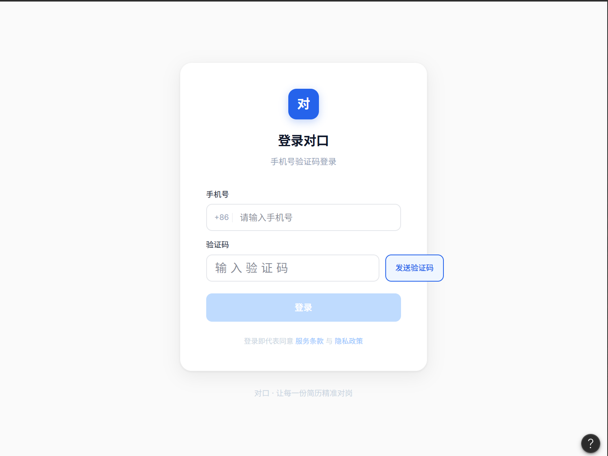
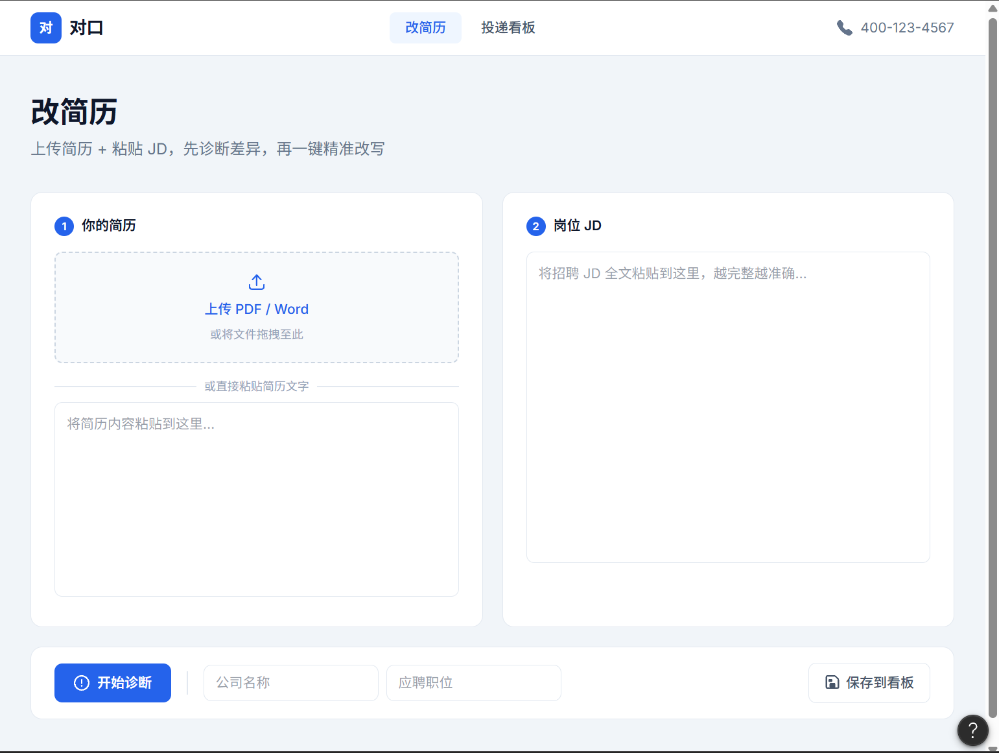
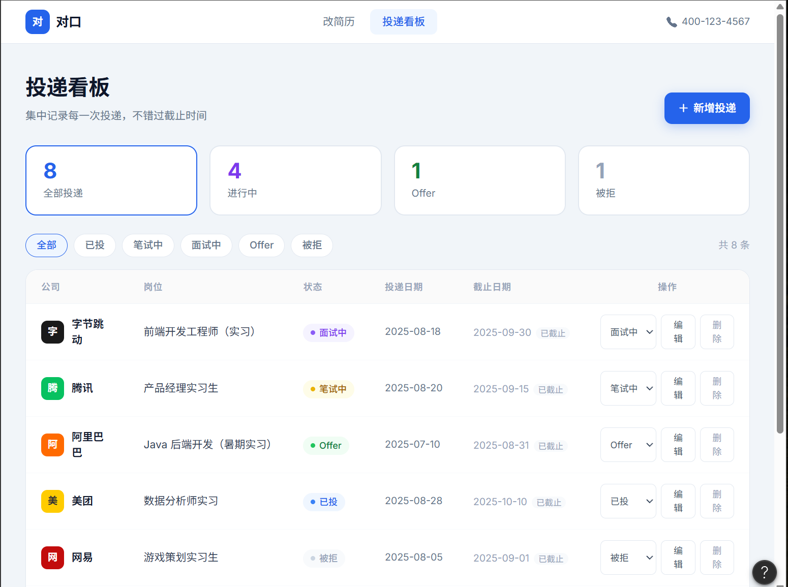

# 06 · 原型与交互稿

> 「对口」的高保真原型图与交互流程。原型图由 Figma 绘制导出,交互流程用 Mermaid 表达。

## 目录结构

```
06-原型与交互稿/
├── README.md            # 本说明(含 Figma 导出规格)
├── 核心用户动线.md       # 交互流程图(Mermaid,GitHub 可渲染)
└── 页面截图/            # Figma 导出的 PNG 放这里
    ├── 01-登录页.png
    ├── 02-改简历页.png
    └── 03-投递看板页.png
```

## 原型图预览

### 01 · 登录页



### 02 · 改简历页(核心)



### 03 · 投递看板页



---

## 一、Figma 导出规格

| 项 | 要求 |
|----|------|
| 画布尺寸 | 桌面端 Web,宽 1440px(高度按内容) |
| 导出格式 | PNG |
| 缩放 | 2x(清晰度更好) |
| 命名 | `01-登录页.png`、`02-改简历页.png`、`03-投递看板页.png` |
| 放置位置 | 本文件夹下的 `页面截图/` 目录 |

## 二、需要绘制的关键页面(3 个)

### 01 · 登录页

| 区块 | 元素 |
|------|------|
| 居中卡片 | Logo「对口」+ 标题「登录对口」+ 副标题「手机号验证码登录」 |
| 表单 | 手机号输入框、验证码输入框 +「发送验证码」按钮 |
| 操作 | 「登录」按钮(主色蓝) |

### 02 · 改简历页(核心,最重要)

| 区块 | 元素 |
|------|------|
| 顶部导航 | Logo「对口」+ 菜单「改简历 / 投递看板」+ 右侧手机号 |
| 页面标题 | 「改简历」+ 副标题「上传简历 + 粘贴 JD,先诊断差异,再一键精准改写」 |
| 左栏 | 「① 你的简历」:上传按钮 + 简历文本预览区 |
| 右栏 | 「② 岗位 JD」:JD 粘贴输入区 |
| 操作行 | 「开始诊断」按钮 + 公司名/岗位输入框 +「保存到看板」 |
| 诊断结果 | 「③ 差异诊断报告」:结论条 + 左「JD 能力要求」列表 + 右「匹配情况」(✓命中/✗缺失/△薄弱) |
| 操作栏 | 「⚡ AI 一键改写简历」+ 命中/缺失/薄弱计数 |
| 改写结果 | 「④ 改写结果」+「导出 Word」「导出 PDF」两个按钮 |

### 03 · 投递看板页

| 区块 | 元素 |
|------|------|
| 顶部导航 | 同上 |
| 页面标题 | 「投递看板」+ 副标题 +「+ 新增投递」按钮 |
| 新增表单 | 公司名、岗位、截止日期输入 + 保存 |
| 数据表格 | 列:公司 / 岗位 / 状态 / 投递日期 / 截止 / 操作 |
| 状态标签 | 已投(蓝)/ 笔试(黄)/ 面试(紫)/ Offer(绿)/ 被拒(灰) |

## 三、配色参考(与 MVP 一致)

- 主色:蓝 `#2563eb`(按钮/链接)
- 强调:绿 `#059669`(成功/导出 PDF)
- 背景:浅灰 `#fafafa`,卡片白 `#ffffff`
- 文字:深灰 `#18181b`,次要 `#71717a`
