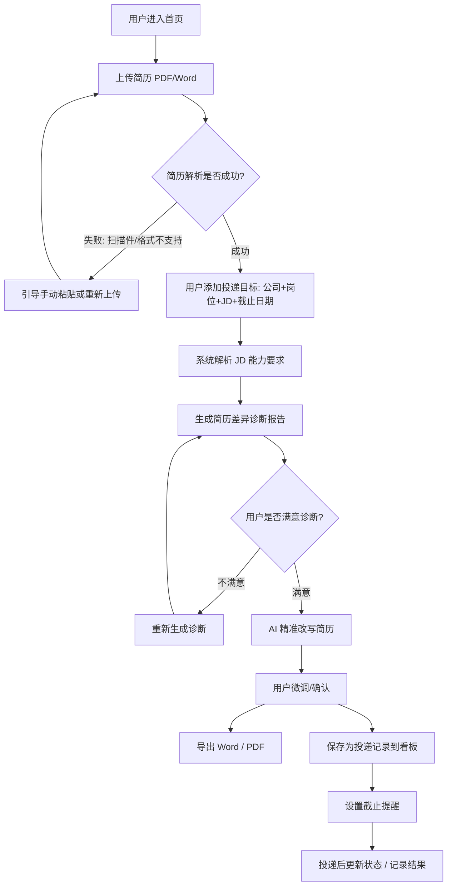

# 核心用户动线(交互流程图)

> 对应 PRD 第 3 节。展示用户从上传简历到完成投递记录的完整路径,含异常分支。

## 关键异常分支说明

| 分支 | 触发 | 处理 |
|------|------|------|
| 简历解析失败 | 扫描件 / 格式不支持 | 引导手动粘贴或重新上传 |
| 诊断不满意 | 用户对结果有异议 | 重新生成诊断 |
| 无真实经历可改写 | 简历缺对应能力 | 标注「⚠️ 无法改写」,不编造 |
